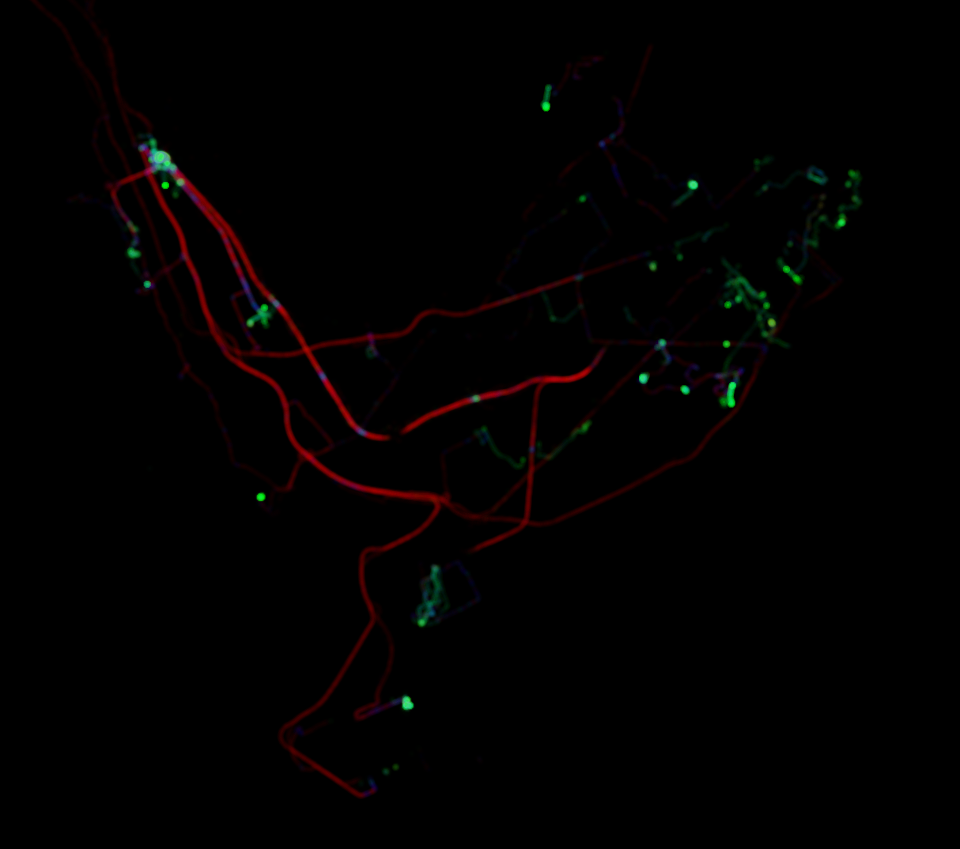

terra-cognita
=============

Intro
-----
This is a personal project in which I visualize my own GPS traces, creating a kind of visual registry of the places I've been to and thus the places I know.

Examples
--------

These two images have been generated with GPS data of over one year time span, in two different cities (you have to guess which ones ;-). The color represents the speed:
- green: walking speed
- blue: bycicle speed (actually anything in between walking speed and motorized vehicle speed)
- red: motorized vehicle speed

How to
------
It is written in C++ as an OpenFrameworks application. Quick guide to use/tweak it:

- Download OpenFrameworks and clone this repository somewhere into the "apps" directory that lays inside the OpenFrameworks root directory.
- Copy your GPX files into the bin/data directory relative to the newly created "terra-cognita" directory.

Please note that the code is far from perfect as I don't have more time for it. Use at your own risk... and have fun :-)
